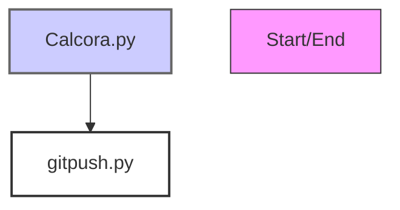

# 📊 Project Structure Diagram

```mermaid
graph TD;
    Calcora[Calcora.py]
    gitpush[gitpush.py]
    start/end[Start/End]
    Calcora --> gitpush;
    classDef node fill:#f9f,stroke:#333,stroke-width:1px;
    style Calcora fill:#ccf,stroke:#666,stroke-width:2px;
    style gitpush fill:#fffc,stroke:#333,stroke-width:2px;
```
